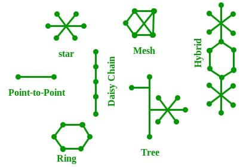

# Basics of Computer Networking

## Table of Contents

- [What is a Computer Network?](#what-is-a-computer-network)
- [How Does a Computer Network Work?](#how-does-a-computer-network-work)
- [Types of Computer Networks](#types-of-computer-networks)
- [Basic Components of a Computer Network](#basic-components-of-a-computer-network)
- [Essential Network Protocols](#essential-network-protocols)
- [Network Topologies](#network-topologies)
- [Essential Services in Networking](#essential-services-in-networking)
- [Network Security](#network-security)
- [Conclusion](#conclusion)

---

## What is a Computer Network?

A **computer network** is a group of interconnected devices that can share resources and communicate with each other. These devices include:

- Computers , - Servers , - Printers , - Routers , - Switches

# ***  Computer networks enable data exchange, allowing applications such as email, file sharing, and web browsing. Networks can range from small local networks to large-scale global systems like the Internet.

---

## How Does a Computer Network Work?

Computer networks function through **nodes** and **links**:

- **Node**: -  A device on the network, such as a computer, modem, or router.
- **Link**: -  The medium for data transfer, including physical cables, wires, or wireless signals.

Data transfer across networks follows specific rules, known as **protocols**. Each device on a network is assigned a unique identifier called an **IP Address**, allowing it to communicate with other devices.

### Key Functions of Modern Computer Networks

Modern networks provide more than simple connectivity:

- **Virtualization**: Networks can be split into smaller virtual networks, enabling data to travel through multiple routes.
- **Scalability**: Tools like automation and monitoring allow networks to expand or contract based on demand.
- **Adaptability**: Software controls allow network settings to be adjusted rapidly.
- **Security**: Networks incorporate features like encryption and access controls to protect data.

---

## Types of Computer Networks

Computer networks vary in size and purpose, and include:

- **Personal Area Network (PAN)**: Connects devices within a personal range, like a Bluetooth connection.
- **Local Area Network (LAN)**: Connects devices in a small geographic area, such as an office or building.
- **Metropolitan Area Network (MAN)**: Covers a larger area than LAN, often used in cities.
- **Wide Area Network (WAN)**: Spans large geographic areas, such as the Internet.

---

## Basic Components of a Computer Network

The main components that make up a network include:

### 1. **Nodes**

Devices connected to a network, such as computers, servers, routers, and printers.

### 2. **Protocols**

Rules and standards that determine how data is transmitted. Common protocols include:

- **TCP/IP**: Foundation of the Internet; defines how data should be packaged, transmitted, and received.
- **HTTP/HTTPS**: Protocols for transferring web data securely.
- **FTP**: Protocol for transferring files between computers.

### 3. **Topology**

The physical or logical arrangement of network devices:

- **Bus**: Devices connected along a single cable.
- **Star**: Devices connected to a central hub.
- **Ring**: Devices connected in a circular manner.
- **Mesh**: Every device connects to every other device, providing redundancy.
- **Tree**: Hierarchical structure that resembles a tree.

### 4. **IP Address**

A unique identifier for each device on a network. **IPv4** and **IPv6** are two versions, with IPv6 offering a larger address space.

---

## Essential Network Protocols

Protocols establish guidelines for communication across networks:

- **TCP/IP** (Transmission Control Protocol/Internet Protocol): Foundation for Internet communication.
- **UDP** (User Datagram Protocol): Similar to TCP but provides faster, connectionless data transfer.
- **SMTP** (Simple Mail Transfer Protocol): Protocol for sending emails.
- **POP3/IMAP**: Protocols for retrieving email from servers.

---

## Network Topologies

### Bus Topology

All devices connect along a single central cable. It is simple but can be prone to data collisions.

### Star Topology

All devices connect to a central hub. Easy to troubleshoot and commonly used in LANs.

### Ring Topology

Each device connects to two other devices, forming a circular path. Data flows in a single direction, reducing collisions.

### Mesh Topology

Each device connects to every other device, offering high redundancy but with increased cabling.

### Tree Topology

A hierarchical layout resembling a tree structure. Commonly used in WANs.

---

## Essential Services in Networking

### Domain Name System (DNS)

DNS is responsible for translating human-readable domain names (e.g., `www.example.com`) into IP addresses that devices use to communicate.

### DHCP (Dynamic Host Configuration Protocol)

Automatically assigns IP addresses to devices on a network, simplifying management and setup.

### Firewalls

Devices or software that monitor and control network traffic, protecting the network from unauthorized access.

---

## Network Security

Security is a critical component of networking:

- **Encryption**: Converts data into a secure format that can only be read by authorized users.
- **Antivirus and Malware Protection**: Prevents malicious software from compromising network devices.
- **Access Control**: Limits network access to authorized users and devices.
- **Firewalls**: Protect networks from unauthorized access by controlling traffic based on security rules.
